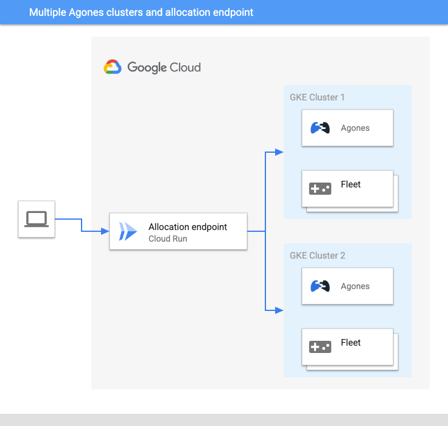

## Overview

This is an example of using [Terraform][tf] (version > 1.0.0) to create multiple GKE clusters with installed Agones along with allocation-endpoint in order to handle a single endpoint for allocating gameservers.

> Disclaimer #1 <br>
> Although Agones can be used in any Kubernetes cluster including but not limited to Google Cloud GKE allocation-endpoint today will work only with GKE clusters therefore in this repository in order to make it simple to deploy and understand I assume that all resources are deployed to Google Cloud.
Also do bear in mind that infrastructure that will be created after you run the script <span style="color:red">could cost you some money</span>. So before running ```terraform apply``` please check what resources will be created and if you are willing to pay for them. Also if you finished with your tests please run ```terraform destroy``` as soon as possible... unless you want to run GameServers on it and keep it alive... then just leave it :) 

> Disclaimer #2 :) <br> 
> This it nothing "new" in some sense. It was build with the use of existing resources and heavily uses existing parts of the terraform code from other parts of this repository like: <br>
> 1. Both helm3 and gke modules from https://github.com/googleforgames/agones/tree/main/install/terraform/modules 
> 2. Existing allocation-endpoint available here: https://github.com/googleforgames/agones/tree/main/examples/allocation-endpoint
> 3. Description on how to enable metrics available here: https://agones.dev/site/docs/guides/metrics/ <br>
> 
> What this example does though is to simplify deployment of multi-cluster setup with allocation endpoint. It is probably not production ready but if you intend to test allocation-endpoint with multiple clusters it will make your life easier. It helped me with my tests. 

## Main components

1. **VPC with 2 subnets** - One subnet per region that is used. You can easily add additional ones (as described in ./terraform/main.tf file)
2. **Service account** - It is used by our workloads on GKE
3. **2 GKE clusters** in two different regions with workload identity enabled. Again you can make as manny as you like. To do that you need to modify ./terraform/main.tf file)
4. It will install **Agones** on all configured servers. By default it will setup both Agones clusters to export metrics to GCP native mechanism (Cloud Monitoring)
5. Will **enable all prerequisites** as described in **allocation-endpoint** example. 
6. Will install all resources needed to setup **allocation-endpoint** on Google Cloud Run. 

## Installation
1. Clone / download agones repository. 
2. Check terraform backend configuration in ./terraform/main.tf file. For testing purposes we use a local file as a backend so no additional configuration is provided. It will work but for more collaborative approach and to keep your state file safe I strongly suggest to keep the backend in Cloud Storage as described here: https://www.terraform.io/language/settings/backends/gcs
3. Check the terraform.tfvars file for how the initial setup was configured. Variables are described in variables.tf file. For "fast testing" you can keep everything as it just update value in line <br>
```project = "your-project-name"``` in terraform.tfvars file.
4. Run ```terraform init``` to pull all dependencies and to setup the backend in ./terraform folder 
5. Run ```terraform plan``` check resources... I know, I know it's ~30 of them but it's better just in case to check them before applying. 
6. If everything seems fine, run ```terraform apply``` and after all resources are created... enjoy :) 

After resources are created you will see in terraform outputs details about: 
1. What is the command you need to run to pull credentials for all created clusters 
2. What is URL for allocation-endpoint

## After installation
1. Check some examples for gameservers like Xonotic or supertuxcart both are available in ./examples folder. 
2. You can allocate GameServer by invoking allocation-endpoint directly or with the use of available clients (check https://github.com/googleforgames/agones/tree/main/examples/allocation-endpoint for details)... Just remember about using keys for "your" service account instead of the one that is in the allocation-endpoint/client folder :)
3. If you deploy fleet https://agones.dev/site/docs/getting-started/create-fleet/ with fleet autoscaler https://agones.dev/site/docs/getting-started/create-fleetautoscaler/ do remember that node pools created for linux based workloads in this example have autoscaling by default. It means that if you create enough GameServers to fill all existing nodes GKE will create more nodes (by default up to 5).
4. If you want to check metrics do remember that this example enables metrics in Cloud Metrics by default. To check available metrics go to Cloud Monitoring and enjoy :) or follow guide that is available here: https://agones.dev/site/docs/guides/metrics/#stackdriver-installation 


## Tips & tricks 
1. You can run ```terraform apply``` and ```terraform destroy``` as many times as you like BUT after you destroy resources one single resource will be actually not destroyed but more like "marked as to be deleted". I mean allocation-endpoint service. So if you delete it and try to apply again GCP will complain that there is already a service with that name but marked for deletion. Fear not! There is a way :) just run ```gcloud endpoints services undelete [your service]``` to undelete the service (e.g. ```gcloud endpoints services undelete agones-allocation.endpoints.my-awesome-project.cloud.goog```) once that is done if you rerun ```terraform apply``` it should work as expected :) 
2. Remember that you can run more than just two clusters just follow comments in main.tf file.


## TODO
In the near (I hope but cannot promise) future I intend to:
1. Use Cloud Build https://cloud.google.com/build to automate builds so you could easily test automation of deploying Terraform resources. 
2. Use Cloud Deploy https://cloud.google.com/deploy to automate deployments to GKE clusters.
3. Get rid of as much "local-exec" that currently exist in code as possible. 

[tf]: https://www.terraform.io/